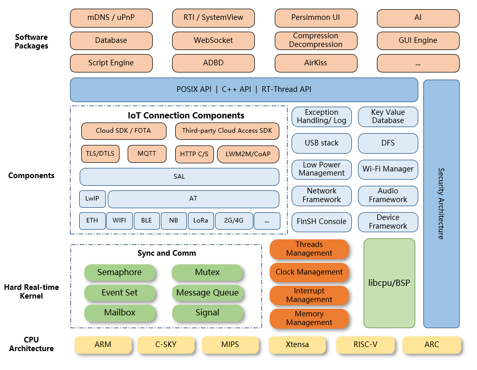

_初探 RT-Thread_
<!--more-->

## 緣起

從大學上過作業系統（OS）課程以後，對於整個系統運作就一直抱有一種很不明的情愫（？

透過一段程式調度整個硬體設備，包括邏輯運算中樞，各種通訊界面，還有控制外部週邊單元，還要應付~~毛病一堆~~的使用者，如果把作業系統放在現實生活根本就是神一般的人物吧？

總之，在學到作業系統以後對於運用和編寫作業系統這件事一直都抱有憧憬。

後來大學開始使用 Linux 系統，並因緣際會的學到了一些 Kernel 知識和 Kernel module 開發，對作業系統更加著迷了，但受限於 Linux 這種大型且複雜的作業系統，我也只能在旁邊摸摸皮毛過過乾癮，但總覺得參與感不夠。

後來大學專題因為主題是 BLE Mesh，為了能夠良好的移植 Bluetooth 的協議層，接觸到了 Linux Foundation 底下的 [Zephyr Project](https://zephyrproject.org/)，開始接觸並使用 RTOS，不過這時還是以應用為主。但是心底一直有個想法，應該真正的去摸清楚整個 RTOS 的實做，並且透過自己重新實現來加深理解整個作業系統的概念。但是可以說自己懶，或是一直找不到很合適的專題或機會去真正實現這個想法。

到現在剛好在工作上碰到系統需要規劃使用 RTOS，決定正式開啟這個學習計劃。

至於選擇 RT-Thread 也沒有什麼特別的理由，第一是程式組成順眼，至少我可以比較輕鬆的了解整個檔案架構（相比於最早接觸的 Zephyr OS，儘管功能很強，可是整個架構太多可以學習的地方讓人不知道要怎麼下手），第二是程式碼風格也很簡潔，組成也易懂，第三是 RT-Thread 有一個很簡單的內核實現 RT-Thread Nano，能夠讓我很簡單的剝離出我最想先學習的內核架構使用，並且在整合進 STM 系列生態系也簡單許多。

## RT-Thread 簡介

以下內容主要出自於 [RT-Thread](https://www.rt-thread.io/index.html) 官網


RT-Thread 是源自中國的一個開源 RTOS，主要由 C 語言撰寫，而且是使用 OOP (Object-oriented programing) 方法撰寫的。其主要 Architechture 如下：

RT-Thread 的實現功能非常豐富，而我對下面幾個已實現部份感興趣：

  1. __Hard Real-time Kernel__ : RTOS 主要的核心功能，用這個部份來熟悉整個作業系統的運作模式
  2. __IoT Connection Components__ : 包括底層通訊規範（ETH、Lora...）到上層的協議規範（LwIP）或是更上層的應用，透過已經實現的規範更了解通訊機制，而且也想嘗試移植其他工業用規範或應用。
  3. __Exception Handling / Log__ : 通常在建構整個系統，尤其是複雜的整合系統時，最麻煩的就是如何紀錄系統的錯誤，如果有良好的錯誤日誌機制，在系統執行任務出現問題時才能夠快速的定位出問題。
  4. __Network Framwork__ : 如上面的 IoT Connect Components 一樣。
  5. __FinSH Console__ : 過去在開發 bare metal 的應用時，沒有標準化輸入輸出介面真的有點麻煩，能夠蹭別人開發好的當然讚。
  6. __Key Value DB__ : Key-Value 結構在之前開發應用的時候很常用到，尤其是 JSON 輸出，在應用層協議真的用起來很有彈性。
  7. __Device Framework__ : 抽象化介面對於應用開發真的是一個福音，但是建立一個良好的設備系統真的是大學問。
  8. __POSIX API__ : POSIX 畢竟行之有年，而且許多應用也都是會根據 POSIX 進行開發，如果能夠移植 POSIX 對於各類應用的適配性一定有幫助。
  9. __RTI SystemView__ : 過去在使用 FreeRTOS 時有使用過一次 SystemView，對於圖形化整個 RTOS 運作的強大功能印象深刻。
  10. __Utest__ : RT-Thread 下的單元測試框架，能夠針對運行在 RT-Thread 上的程式模組進行 Unit test 並記錄結果。

除了上述功能以外，也對 RT-Thread 實現的一些手法感興趣，例如：
  
  1. __Object Oriented__ : RT-Thread 是使用 Object Oritened method 進行程式編寫的，並且對於內核的一些物件有特殊的機制去管理。
  2. __Kconfig__ : 過去對於 Linux 的內核配置選單就很感興趣，之前在 Zephyr 也體驗過，這次想深入了解到底要怎麼用。

## 目前規劃

首要目的當然是希望透過理解 RT-Thread 的 Source Code 更理解整個 RTOS 乃至 OS 的概念，以及實現辦法。所以應該會先就 RT-Thread 的內核實現進行一系列學習和研究：

  1. 內核 Object 的實現
  2. IPC 的實現 (Mutex, Semaphore, Event, Mailbox ...)
  3. Scheduler 和 Thread 的實現
  4. 內存管理

由於目前使用的是 Nano 版本，希望能夠自己移植其他感興趣的功能上去，除上述原先 RT-Thread 標準版就有的功能以外，還想嘗試增加：
   
   1. 針對整個程式（包含 Kernel 部分）的 Unit Test（目前候選是 Unity）
   2. DDS 的移入
   3. 針對有限狀態機的實現

就，慢慢來開始建構自己想要的東西 :rofl:

## 後語

這篇只是簡單寫寫目前自己的規劃，也沒包含什麼太有意義（？的東西，主要是寫來督促自己，希望自己能夠持續的更新這系列文章。