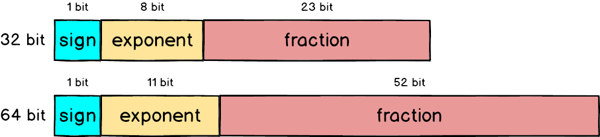
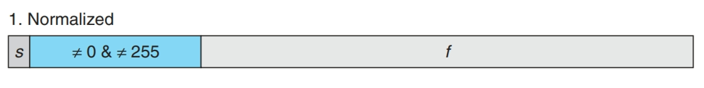
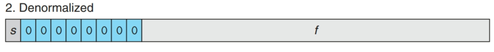
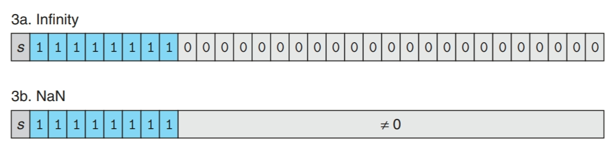

_討論一點浮點數_
<!--more-->
## 前言

不久前，朋友在群組貼了一篇文章，引起了我的興趣，文章內容大致是在討論IEEE 754關於浮點數中+0與-0的差異以及運算性質，看了看突然發現自己對於浮點數的概念幾乎忘的一乾二淨了，再加上對於文中的性質也有不小的興趣，因此乾脆開始了浮點數的學習之旅。

實際上這篇文章應該是兩年多前寫給自己看的，搬運過來水一篇文章XD

## 關於浮點數…

浮點數(Floating Number)，是常見紀錄小數手段，相對於定點數(Fixed Number)，浮點數利用 $N = X × 2^y$ 使得小數點的位置並不固定，讓能夠紀錄的數字達到更廣的範圍。

其中，在1985年提出的IEEE 754規範了目前的浮點數格式，並沿用至今。

## IEEE 754

先由浮點數的格式入手，可以分為三個部份： 

- Sign
- Exponent
- Significand

Sign用來表示此數字的正負號，只有1 bit，Exponent 則用來表示2的乘冪，Significand 則用來表示尾數。大致如下：

$$ (− 1)^s × M × 2^E\quad——— \quad(1)$$     

而在C語言中的 Float(32-bits) 和 Double(64-bits) 分別對應如下：



而其中，一個IEEE 754規範的浮點數又可以分為三個種類：

1. 規格化數 (normalized)
2. 非規格化數 (denormalized)
3. 特殊值 (special: NaN, Ifinity)

### 規格化數(Normalized Value)



規格化數是浮點數格式中佔最多的種類，其Exponent的部份介於255和0之間。在這個種類中:

**Exponent** 的部份會表示為 $E = e − Bias$，$E$ 為上方(1)式的2的乘冪部份，$e$ 為 Exponent 部份所表示的**無號整數**，$Bias$ 為 $2^{(k − 1)} − 1$，其中 $k$ 表示為 Exponent 部份的 bit 數，因此 Float 的 $Bias$ 為 $2^{(8 − 1)} − 1 = 127$，Double 的 $Bias$ 為  $2^{(11 − 1)} − 1 = 1027$。

**Significand** 的部份會表示為 $M = 1 + f$，也就是 $1.f_{n − 1}f_{n − 2}f_{n − 3}...$ ，這種方法可以使 Significand 的部份可以增加 1 bit 的精度(因為前方多了一個隱含的開頭1)，因此可以肯定

$$0<=fraction<1$$

### 非規格化數(denormalized Value)



為了表達規格化數無法表達的更小的浮點數，IEEE 754提供了一個特性稱為 Gradual underflow ，讓浮點數表示能夠平滑的向下接近 0 的數字，也就是非規格化數的種類。

非規格化數的 Exponent 全為 0，而 $E = 1 − Bias$，$M = f$，相較於規格化數，非規格化數少了M的隱含開頭1。

其中，當 fraction 全為零，sign 為 0 時，可以得到 +0.0，而 sign 為 1 時，可以得到 -0.0，這樣設計的好處是，假設一個數字經過運算後已經過小到浮點數無法表示的程度，但是 +0.0 和 -0.0 仍然可以讓我們輕鬆知道這個數字原始是大於 0 或是小於 0 的。


+0.0 和 -0.0 在 IEEE 754 規格中是兩個不同的值( sign 不同)，但是其進行對比得出的結果會是 equal 的，但若進行其他運算則又有可能得出不同的結果，而這些特殊運算結果都是有定義的。



關於 $E=1−Bias$ 而非 $E=−Bias$ 是因為這樣提供了規格化數到非規格化數平滑的過度。



### 特殊值(Special Value)



當 Exponent 部份全為 1 時，會得到特殊值，如圖所示。

### 特殊運算

IEEE 754 有很好的定義了個別特殊運算的結果：



其中 NaN 與任何數字做任何運算都會得出 NaN 的結果。

### 程式驗證


以下程式參考於一系列的 [blog](https://randomascii.wordpress.com/2012/02/25/comparing-floating-point-numbers-2012-edition/) 並使用 g++(C++14) 編譯與 gdb 進行 debug



```cpp
#include <iostream>
#define _DEBUG

union Float_t{ 

	Float_t(float num):f(num){}    
	bool Negative() const{ return (i>>31)!=0;}             //Sign    
	int32_t RawMantissa() const{return i & ((1<<23)-1);}   //Significand    
	int32_t RawExponent() const{return (i>>23)&0xFF;}      //Exponent    
	int32_t i;      //IEEE 754 float的直接轉成正整數表達結果  
    float f;        //IEEE 754 float

#ifdef _DEBUG    
	struct{
		uint32_t mantissa:23;    //Sign        
		uint32_t exponent:8;     //Exponent        
		uint32_t sign:1;         //Significand    
	}parts;
#endif

};

int main(){    
	union Float_t num(1.0f);    
	for(;;){                   //Breakpoint here.    
	printf("%1.8e,0x%08X,%d,%d,0x%06X\n",
				num.f, num.i, num.parts.sign, num.parts.exponent, num.parts.mantissa);
	}
}
```

利用gdb進行debug修改各個部位的數值並觀察，其中下面給出幾個比較特殊的結果： （皆以sign = 0作為範例）

- 0 (float)
    
    
    
- 1 (float)
    
    
    
- 最大標準化數
    
    
    
- 最小標準化數
    
    
    

- 最大非標準化數

可以看到由於使用 $E = 1 − Bias$ 的關係，最小標準化數與最大非標準化數之間有平滑的過度    

    

    
- 最小非標準化數
    
    

- NaN
    
    
    
- Infinity
    
   
    
- 最大整數奇數  此數字為float所能表示的最大奇整數，由於其Significand為最大，且Exponent經過Bias運算後正好為23，對應Significand 的23 bits，在此數過後由於Exponent將會>23，所以無法在表示出任何奇數，換句話說，在16777216之後的整數，float在表示時精度都會小於同數字的 int表示方法。如下圖所示:  可以看到當>16777216之後的所有奇數都會無法表示。
    
        
 \
    
    

## IEEE 754浮點數以及其整數格式…

- 當遞增浮點數無號整數表示時的值，其對應的浮點數數值也會朝著遠離零的方向移動。因此浮點數能夠使用整數序函數來進行排序。
- 以下程式為一道 ***Computer Systems: A Programmer’s Perspective*** 書內的題目： 撰寫一個函數，只能使用給定的幾個參數測試輸入函數的第一個參數是否小於等於第二個參數，又假設兩個參數不會有NaN，並且+0和-0被認為是相同的。

```c
// 使用gcc進行編譯
union Float_t{    
	float f;    
	unsigned int ui;
};

int float_le(float x, float y){ 
  
	union Float_t X,Y;
	X.f = x;    
	Y.f = y;    // Get the sign bits    
	unsigned int sx = X.ui>>31;    
	unsigned int sy = Y.ui>>31;

	// Given an expression using only X.ui, Y.ui, sx, and sy
	return sx==sy?((X.ui<<1)<=(Y.ui<<1))^sx:sx|((X.ui<<1)==0&&(Y.ui<<1)==0);
}
```

## Reference

[IEEE Standard 754 Floating Point Numbers](https://steve.hollasch.net/cgindex/coding/ieeefloat.html?fbclid=IwAR0V7qUZKU9ymFCdFnMz-Z3yF9XBISKBVNIxBvKGVS_4MDxvbXvuSKC07g0) 

[Floating Point](https://chi_gitbook.gitbooks.io/personal-note/content/floating_point.html)

[Comparing Floating Point Numbers, 2012 Edition](https://randomascii.wordpress.com/2012/02/25/comparing-floating-point-numbers-2012-edition/) 

***Computer Systems: A Programmer’s Perspective***