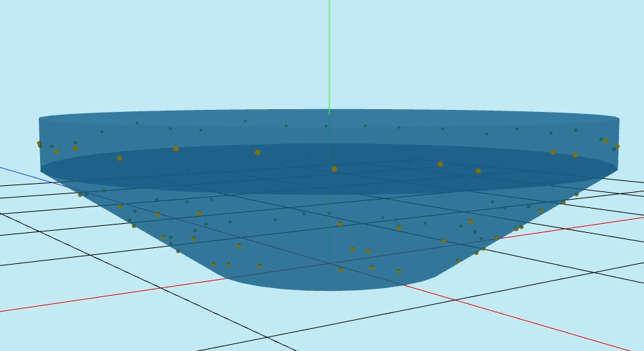
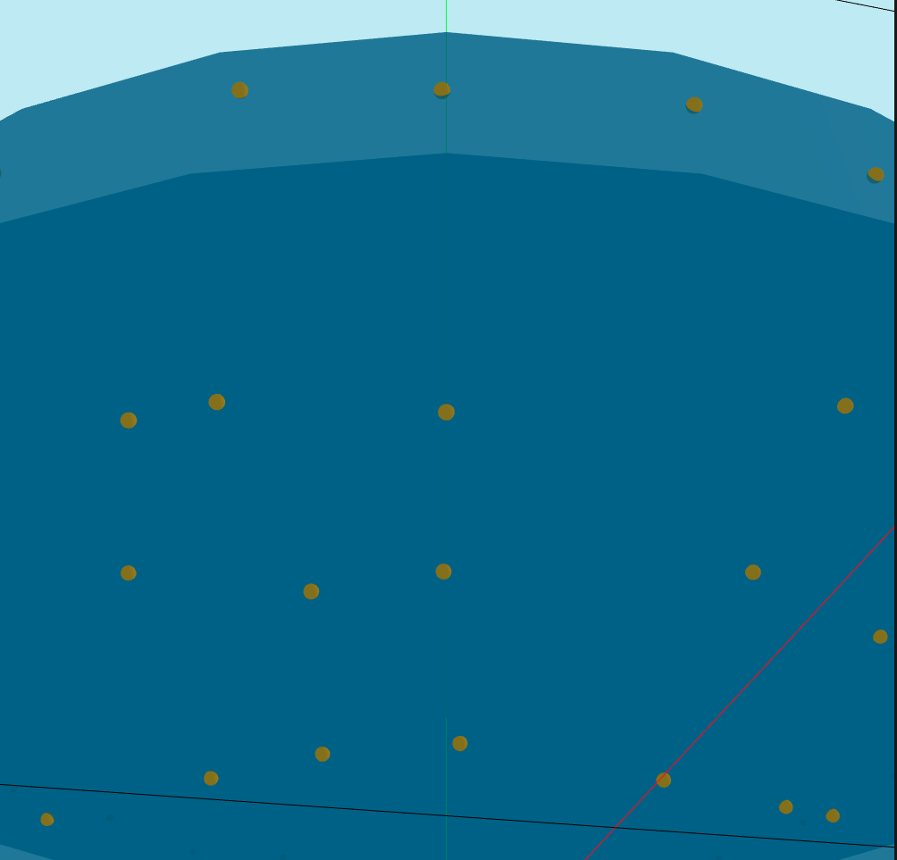
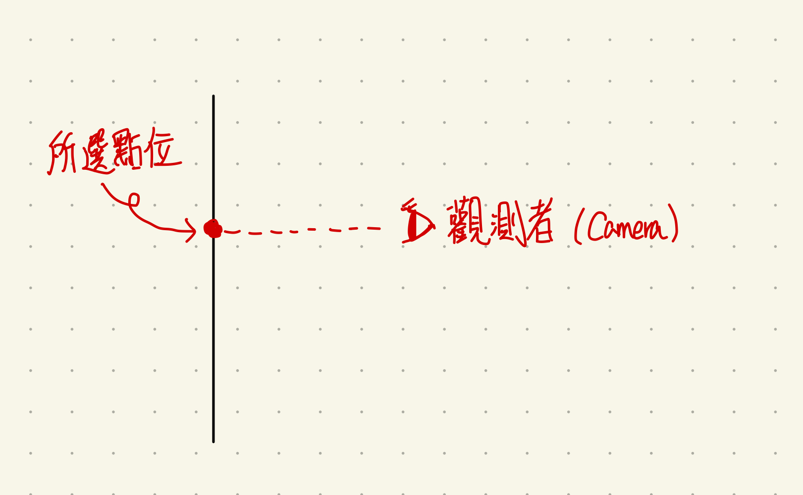
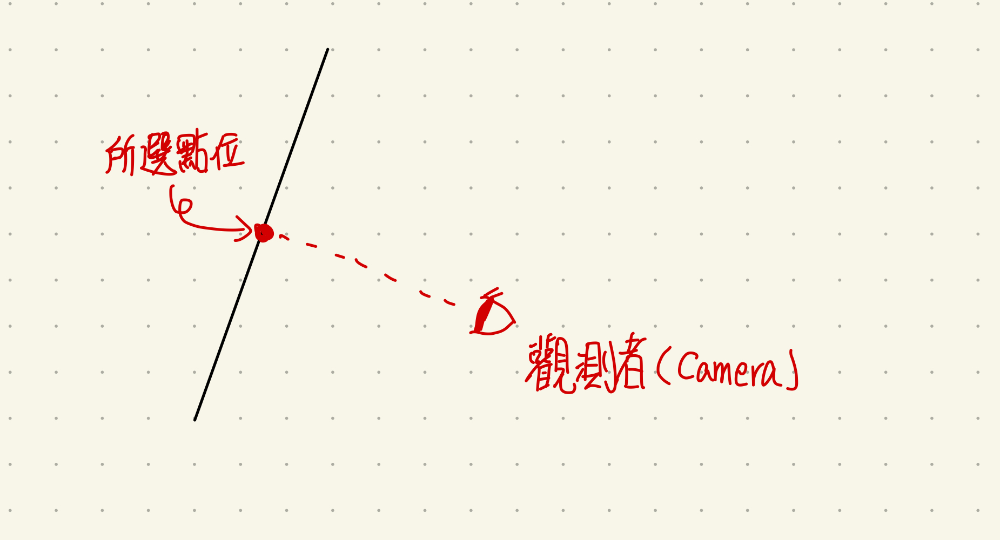
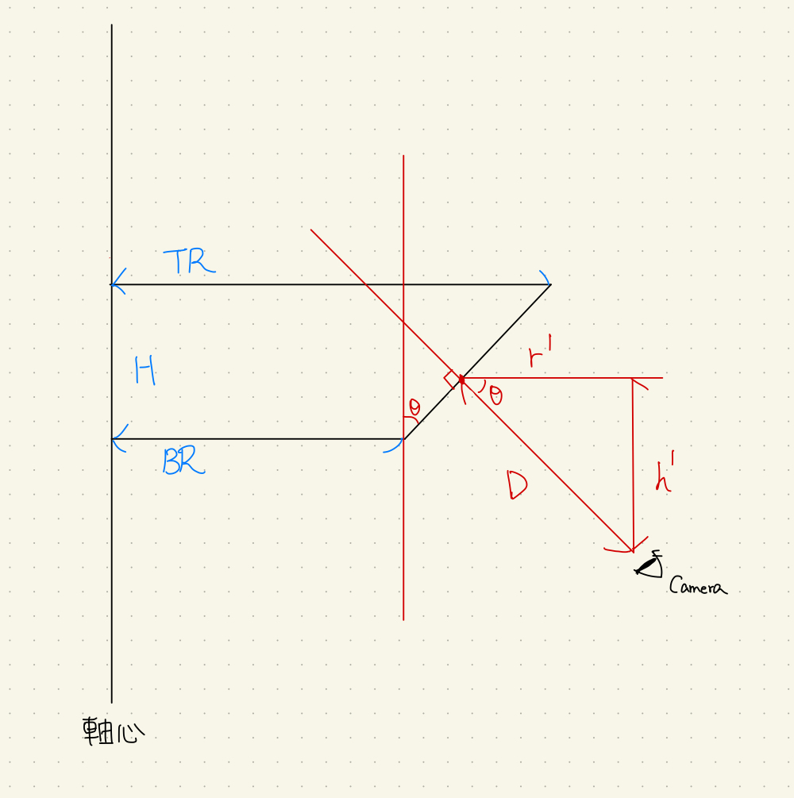

*從零開始的一點前端小旅程*
<!--more-->
## 前言

週五下班前和同事聊到公司的某個系統功能開發的想法，聊著聊著就突然來了興趣，想著坐而言不如起而行，直接上手試試看最不熟練的前端。

由於公司是用 [Vue](https://vuejs.org/) 當作開發框架，然後我想試試看 TypeScript 進行開發，因此整個開發便是在 Vue.js + [Three.js](https://threejs.org/) + TypeScript 底下完成。

## 開發功能描述

先簡略描述一下系統狀態，有個 3D 模型，上面會有數個測量點顯示在模型上，如下圖所示：

然後每個點上都會有個針對這個模型的一些數值，主要就是想開發一個功能，如果點擊/搜尋到畫面上的任意測量點，會把視角移動到最適合使用者看到點的位置，如下圖所示：

那對我來說會有幾個難點：

1. 因為前端網頁以及框架的不熟悉，所以幾乎需要從零開始學習這次所需要的 Vue 框架，前端 3D 套件 Three.js，以及 TypeScript 。
2. 由於模型多少還是有一定的複雜度，因此在移動相機視角的時候必須根據測量點在模型上的哪個位置進行視角改變，如果測量點在模型傾斜 45 度角的位置，就必須讓視角也跟著傾斜 45 度角，才能達到最好的視角角度。
3. 因為希望能夠讓這份程式有重用性，以及希望嘗試一點設計方法，因此會需要在一開始就規劃一下程式架構。

## 程式架構講解

### 架構簡述

主要架構大致如下：

classDiagram
  class BaseModel{
    model_type : model_base
    allBaseObject : Array
    search_points(x : number, y : number, z : number, d : number) Vector3
  }
  class model_base{
    <<interface>>
    construct_Mesh() Array
    calculate_and_compare_point(point_height : number) number
    getCameraPosition(x : number, y : number, z : number, distance : number) Vector3
  }
  class cylinder_model{
    CylinderArray : Array
    params : Array
    layer_Height : Array
    layer_TRadius : Array
    layer_BRadius : Array
    calculate_y_offset() number
    record_layer_info(height : number, tradius : number, bradius : number)
    construct_Mesh() Array
    calculate_and_compare_point(point_height : number) number
    getCameraPosition(x : number, y : number, z : number, distance : number) Vector3
  }
  class other_model{
    construct_Mesh() Array
    calculate_and_compare_point(point_height : number) number
    getCameraPosition(x : number, y : number, z : number, distance : number) Vector3
  }
  BaseModel  -->  model_base : Contains
  model_base <|.. cylinder_model : implements
  model_base <|.. other_model : implements


我希望利用 interface 來隔開實際上不同模型的實現方式，如可以利用圓柱層層疊加產生的模型、球體模型、透過外部引入的模型等...
最後再透過最外層的 BaseModel 操作整個模型，讓上層應用的開發者在操作時不必知道實際上操作的是哪個模型，這樣之後再增加模型時也會比較好增加，只需要增加新的 Class 並實現 Interface 中的方法。（如 other_model）



1. 實際上這應該是 Abstract factory pattern
2. 也是因為 TypeScript 有 interface 所以我才決定用 TypeScript 而不是 Javascript


大概的程式碼檔案結構如下

* src/components/
  * HelloWorld.vue   --->  主要視圖和 Vue 掛載
  * ts/
    * TBaseModel.ts  --->  這次主要程式碼，司職模型的建構以及計算
    * TData.ts       --->  毫無反應，就是一個紀錄 Data 的檔案
    * TEngine.ts     --->  [網路上文章](https://www.cnblogs.com/wjw1014/p/16825565.html)參考的 Three.js 渲染程式
    * THelper.ts     --->  [網路上文章](https://www.cnblogs.com/wjw1014/p/16825565.html)參考的 Three.js 輔助程式
    * TLights.ts     --->  [網路上文章](https://www.cnblogs.com/wjw1014/p/16825565.html)參考的 Three.js 光線程式
    * TPoints.ts     --->  用來生成測量點模型

### 模型分類
考量到會有不同的模型，因此我先設想了幾個可能性：

  * 圓柱模型：此分類主要特色為透過軸心一樣的圓柱體（包含上下圓半徑不同的圓柱體）來組成模型，用圓柱座標系能夠輕易描述
  * 球體模型：利用球座標建立的模型系列
  * 複雜模型：透過直接外部引入模型檔的方式進行建立的模型系列

目前手上的模型資料大部分都是由第一個模型組成，因此這次會主要建立圓柱模型。

利用 Three.js 圓柱體模型( CylinderGeometry 類 )的彈性（上下半徑可以不同），在建立圓柱體模型時可以利用不同層疊加的方式建立出多樣化的模型，如上圖的錐形實際上就是利用兩個圓柱體實現而成。

但在建立模型類時希望能夠操作同樣一個實體，透過參數自動進行調整就能讓整體的模型順利建立。

例如順序傳入第一層上半徑、下半徑、高，第二層上半徑、下半徑、高，然後就能自動建立出模型。

因此 cylinder_model class 的建構子如下：

```TypeScript
constructor(params: Array<number>) {
  this.params = params
  let index: number = 0;

  if (params.length > 0) {
    while (index < params.length) {

      let CylinderHeight = params[index++]
      let CylinderTopRadius = params[index++]
      let CylinderButtomRadius = params[index++]

      let y_offset = this.calculate_y_offset(CylinderHeight) // 求出每一層的起始高度

      /* 建立 各層 CylinderGeometry 實體 */
      this.CylinderArray.push(
          new CylinderGeometry(CylinderTopRadius, CylinderButtomRadius, CylinderHeight, 32)
              .translate(0, y_offset, 0))
      /* 每層高度計算方式 */
      /*
      * 若共 N 層，每層高度為 H_k，k = [1,N]
      * 則第 K 層的高度偏移為 SUM(H_k) 當 k=[1,K-1]，再加上 0.5 * H_K 
      */ 

      this.record_layer_info(CylinderHeight, CylinderTopRadius, CylinderButtomRadius) // 紀錄每一層的數據
    }
  }
} 
```

可以看到建構子傳入為一個 number array，裡面依序存放著從最底層至最高層的高，上半徑，下半徑。

而由於會需要計算出每一層的起始高度，`calculate_y_offset()`則是用來實現計算每層累積高度的方法。

```TypeScript
/* 簡單計算每層起始高度 */
calculate_y_offset(current_height: number): number {
  let height: number = 0;
  for (let i = 0; i < this.CylinderArray.length; i++) {
    height += this.params[i * 3]
    }
    return height + 0.5 * current_height
  }
```

計算每層起始高度的公式如下：

若 $H_i$ 代表每層的高度，$i\in(1,N)$，而目前要計算第 $K$ 層的高度，$1 \leqq K \leqq N$，則第$K$層起始高度為：
$$\sum_{1}^{K-1} H_i+\frac{1}{2}H_K$$

最後為了之後計算相機移動座標方便，先記錄下每層的三個參數資訊。

```TypeScript
/* 記錄每層資料 */
record_layer_info(height: number, tradius: number, bradius: number) {
  this.layer_Height.push(height)
  this.layer_TRadius.push(tradius)
  this.layer_BRadius.push(bradius)
}
```

### 計算相機座標
上面終於建立好模型了（實際上省略不少部分，但簡單來說就是建立了:rofl:）

那接下來終於能開發主要的功能了，讓相機（視角）移動到所選點位的正前方。

首先要確定一下“正前方“的定義，如果選的點位是在與 XZ 平面垂直的地方，那相機直接移動到距離點位同高度並且平視即可。

但是如果所選點位是和平面有夾角的，那是觀測最佳視角就應該有相應的傾斜角度，使相機位置就會需要進行偏移計算。


那觀測的角度我認為是以視線垂直於平面為最佳觀測角度，因此底下會以這個角度設計。

首先要解決的是，必須先計算出選擇的點在哪層圓柱體上，才能夠根據圓柱體的參數進行視角的計算，好在圓柱體模型要確認層數只需要利用 Y 軸進行判斷即可。

```TypeScript
/* 計算傳入的點在哪一層 */
calculate_and_compare_point(pointX: number, PointY: number, PointZ: number) {
  let result: number = 0

  /* 線性比較高度 */
  while (PointY > 0) {
    PointY = PointY - this.layer_Height[result]
    result++;
  }

  return result - 1
}
```

計算出點位在哪層之後就能開始計算相機位置，那先給個計算示意圖：


$TR$ 是上半徑，$BR$ 是下半徑，$H$ 是層的高度，$D$ 是相機距離量測點的距離。

其中 $\theta$ 是相機與水平的夾角，而我們其實主要要求的是 $h'$ 和 $r'$，也就是相機對於觀測點的 Ｙ 軸偏移量以及 R 軸偏移量（於圓柱座標系)。

求出 $h'$ 的公式如下：
$$h'=D*\sin{\theta}$$
而求出 $r'$ 的公式如下：
$$r'=D*\cos{\theta}$$
而 $\theta$ 則可以透過下式算出：
$$\theta=\arctan{(\frac{TR-BR}{H})}$$
則最後合併式子：
$$h'=D*\sin{[\arctan{(\frac{TR-BR}{H})}]}$$
$$r'=D*\cos{[\arctan{(\frac{TR-BR}{H})}]}$$
得到 Y 軸偏移量後，還需要進行座標轉換，先將觀測點的圓柱座標 $Point = (r,\theta,y)$ 求出，再根據 y 軸的偏移量進行修正 $Camera = (r+r',\theta,y-h')$，就能得到最後的相機位置。

程式實現如下
```TypeScript
/* 計算出傳入的點會需要將照相機移動到何處 */
getCameraPosition(pointX: number, pointY: number, pointZ: number, distance: number) {

  /* 先確定點在哪層 */
  let layer_index = this.calculate_and_compare_point(pointX, pointY, pointZ)

  /* 計算偏移角度 theta */
  let theta = Math.atan((this.layer_TRadius[layer_index] - this.layer_BRadius[layer_index])
                        / this.layer_Height[layer_index])

  /* 計算照相機的 y 軸偏移(於圓柱座標系) */
  let camera_y_offset = distance * Math.sin(theta)
  
  /* 計算照相機的 r 軸偏移(於圓柱座標系) */
  let camera_r_offset = distance * Math.cos(theta)

  /* 將座標轉換回笛卡兒座標 */
  let c = new Cylindrical().setFromCartesianCoords(pointX, pointY, pointZ)
  let c_new = new Cylindrical(c.radius + camera_r_offset, c.theta, c.y - camera_y_offset)
  let v = new Vector3().setFromCylindrical(c_new)
  return v
}
```



當 $TR = BR$ 的時候，由於 $\arctan{0} = 0$，而 $sin{0}=0$ 且 $cos{0}=1$，則回歸到 Y 軸偏移量為零，R 為 1 的簡單狀態。

而 $TR < BR$ 時，由於 $\arctan{-\theta}=-\arctan{\theta}$，而 $\sin{-\theta}=-\sin{\theta}$ 且 $\cos{-\theta}=\cos{\theta}$，因此完全符合實際狀況。


### Interface 

最後講到利用 interface 實現的好處，我建立一個 BaseModel 用來控制所有實現介面的類別。

```TypeScript
export class BaseModel {

  model_type: model_base;
  allBaseObject: Array<Mesh>;

  constructor(model_type: model_base) {
    this.model_type = model_type
    this.allBaseObject = this.model_type.construct_Mesh()
  }

  /* Demo用方法，傳入需要聚焦的點位和希望相機離目標的距離，回傳相機該移動到的地方 */
  search_points(x: number, y: number, z: number, d: number): Vector3 {
    return this.model_type.getCameraPosition(x, y, z, d)
  }
```

當我想建立一個圓柱形模型類別時，我只需要如下建立資料並傳入相應的參數：

```TypeScript
let test_base_model = new BaseModel(new cylinder_model(
    [data.ConeHeight,
    data.ConeTopRadius,
    data.ConeButtomRadius,
    data.Height,
    data.TopRadius,
    data.ButtomRadius]))
```

這樣我之後在操作模型時，只需要操作最外層的模型類別，並不用在意到底現在是哪個種類的模型實現，如下：

```TypeScript
let v = basemodel.search_points(point.x, point.y, point.z, 10)
```

## 結語
最後是功能展示影片：

 
<video width=100% controls autoplay>
    <source src="./DemoV.webm" type="video/webm">
    Your browser does not support the video tag.  
</video>

老實說這次的 Vue 輕旅程還滿有趣的，難得的在一定的時間沈浸在完全的程式裡面進行開發（可憐的嵌入式工程師總需要編寫程式邊確定硬體有沒有出錯:cry:）

再加上能夠多少測試一下一些開發的方式，其實收穫還滿大的:laughing:

原始程式碼會放在 [github](https://github.com/Lizhou31/vue-threejs) 上。